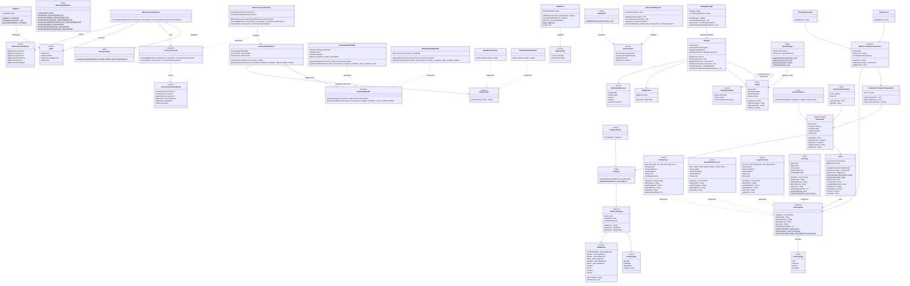

# OOP25-UniBodget — Model - UML Class Diagram
GitHub renders the diagram below automatically.

```mermaid
classDiagram
    direction TB

    %% ============================================================
    %% =================== CATEGORIES =============================
    %% ============================================================

    class AbstractCategory {
        <<abstract>>
        -String name
        -ARGBColor color
        -CategoryType type
        +getName() String
        +getColor() ARGBColor
        +getType() CategoryType
    }

    class Category {
        <<final>>
        +Category(String, ARGBColor, CategoryType)
        +getDefaultCategories()$ List~Category~
    }

    class CategoryPreset {
        <<enum>>
        +toCategory() Category
    }

    class CategoryType {
        <<enum>>
        INCOME
        EXPENSE
        TRANSFER
        FRIEND_LOAN
    }

    Category --|> AbstractCategory
    CategoryPreset --> Category
    AbstractCategory --> CategoryType
    AbstractCategory --> ARGBColor

    %% ============================================================
    %% =================== CURRENCY DOMAIN ========================
    %% ============================================================

    class CurrencyUnit {
        <<interface>>
        +getType() CurrencyType
        +getSymbol() String
        +getShortName() String
        +getFullName() String
        +getCode() String
        +getDisplayDecimals() int
        +getByCode(String)$ CurrencyUnit
        +allCurrencies()$ List~CurrencyUnit~
        +allCurrenciesObservable()$ ObservableList~CurrencyUnit~
    }

    class CurrencyType {
        <<enum>>
        FIAT
        CRYPTO
        STOCK
        CUSTOM
    }

    class FiatCurrency {
        <<enum>>
        USD, EUR, GBP, JPY, CHF, CAD, AUD, CNY, ...
        -String symbol
        -String shortName
        -String fullName
        -String code
        -int displayDecimals
        +getType() CurrencyType
        +getSymbol() String
        +getShortName() String
        +getFullName() String
        +getCode() String
        +getDisplayDecimals() int
    }

    class StockMarketCurrency {
        <<enum>>
        AAPL, MSFT, NVDA, AMZN, GOOGL, META, TSLA, ...
        -String symbol
        -String shortName
        -String fullName
        -String code
        +getType() CurrencyType
        +getSymbol() String
        +getShortName() String
        +getFullName() String
        +getCode() String
    }

    class CryptoCurrency {
        <<enum>>
        BTC, ETH, USDT, BNB, SOL, XRP, DOGE, ADA, ...
        -String symbol
        -String shortName
        -String fullName
        -String code
        -String apiId
        +getType() CurrencyType
        +getSymbol() String
        +getShortName() String
        +getFullName() String
        +getCode() String
        +getApiId() String
    }

    class Currency {
        <<final>>
        -String code
        -String name
        -String symbol
        -CurrencyType type
        -int displayDecimals
        +getType() CurrencyType
        +getSymbol() String
        +getShortName() String
        +getFullName() String
        +getCode() String
        +getDisplayDecimals() int
        +saveToFile(Path)$ void
        +loadFromFile(Path)$ List~Currency~
    }

    FiatCurrency ..|> CurrencyUnit : implements
    StockMarketCurrency ..|> CurrencyUnit : implements
    CryptoCurrency ..|> CurrencyUnit : implements
    Currency ..|> CurrencyUnit : implements

    CurrencyUnit --> CurrencyType : classifies

    class Asset {
        -CurrencyUnit currencyUnit
        -BigDecimal amount
        +Asset(CurrencyUnit, BigDecimal)
        +getCurrencyUnit() CurrencyUnit
        +getAmount() BigDecimal
        +of(CurrencyUnit, BigDecimal)$ Asset
        +zero(CurrencyUnit)$ Asset
        +plus(Asset) Asset
        +minus(Asset) Asset
        +multiply(BigDecimal) Asset
        +isPositive() boolean
        +isNegative() boolean
        +isZero() boolean
        +toString() String
    }
    Asset --> CurrencyUnit : uses

    %% ============================================================
    %% =============== CONVERTER ENGINE & PARSING =================
    %% ============================================================

    class CurrencyConverter {
        <<interface>>
        +convert(BigDecimal, CurrencyUnit, CurrencyUnit) CurrencyConversionResult
        +convert(Asset, CurrencyUnit) CurrencyConversionResult
    }

    class BasicCurrencyConverter {
        -UniversalPriceService priceService
        -CurrencyUnit baseReferenceCurrency
        +BasicCurrencyConverter(UniversalPriceService, CurrencyUnit)
        +convert(BigDecimal, CurrencyUnit, CurrencyUnit) CurrencyConversionResult
        +convert(Asset, CurrencyUnit) CurrencyConversionResult
    }

    class CurrencyConversionResult {
        <<record>>
        -CurrencyUnit fromCurrency
        -CurrencyUnit toCurrency
        -BigDecimal sourceAmount
        -BigDecimal convertedAmount
        -BigDecimal appliedRate
        -Instant timestamp
    }

    class MonetaryInputParser {
        <<utility>>
        +sanitize(String)$ String
        +parse(String)$ Optional~BigDecimal~
        +parsePositive(String)$ Optional~BigDecimal~
        +parseNonNegative(String)$ Optional~BigDecimal~
        +parsePositiveWithMaxScale(String, int)$ Optional~BigDecimal~
        +parseDouble(String)$ OptionalDouble
        +parsePositiveDouble(String)$ OptionalDouble
        +parseNonNegativeDouble(String)$ OptionalDouble
    }

    BasicCurrencyConverter ..|> CurrencyConverter : implements
    BasicCurrencyConverter --> UniversalPriceService : delegates
    CurrencyConverter --> CurrencyConversionResult : returns

    %% ============================================================
    %% ================= BANK CONVERSION ==========================
    %% ============================================================

    class Bank {
        <<record>>
        -String name
        -double fixedFee
        -double percentageSpread
        -String notes
    }

    class BankCalculator {
        <<utility>>
        +calculateConversion(BigDecimal, double, double)$ BankConversionResult
    }

    class BankConversionResult {
        <<record>>
        -BigDecimal baseAmount
        -BigDecimal netAmount
        -BigDecimal spreadCost
        -BigDecimal fixedFeeCost
        -BigDecimal totalCost
        -BigDecimal effectiveRate
    }

    class BankConversionService {
        +convert(Bank, BigDecimal, CurrencyUnit, CurrencyUnit, CurrencyConverter) BankConversionResult
    }

    class BankList {
        -List~Bank~ banks
        +getBanks()$ List~Bank~
        +saveBanks(List~Bank~)$ void
        +generateMockBanks()$ List~Bank~
    }

    BankConversionService --> BankCalculator : delegates
    BankConversionService --> CurrencyConverter : uses
    BankConversionService --> Bank : evaluates
    BankConversionService --> BankConversionResult : creates
    BankList --> Bank : loads/saves

    %% ============================================================
    %% ================= PRICE PROVIDERS & CACHE ==================
    %% ============================================================

    class ExchangeRateAPI {
        <<interface>>
        +getLatestRates(CurrencyUnit) Map~CurrencyUnit, Double~
        +getHistoricalRates(CurrencyUnit, CurrencyUnit, LocalDate, LocalDate) Map~LocalDate, Double~
    }

    class ExchangeRateAPIImpl {
        -Duration CACHE_DURATION
        -HttpClient client
        -Instant lastUpdate
        -Map~CurrencyUnit, Double~ cachedRates
        +getLatestRates(CurrencyUnit) Map~CurrencyUnit, Double~
        +getHistoricalRates(CurrencyUnit, CurrencyUnit, LocalDate, LocalDate) Map~LocalDate, Double~
    }

    class MockExchangeRateAPI {
        -Map~CurrencyUnit, Double~ mockRates
        +getLatestRates(CurrencyUnit) Map~CurrencyUnit, Double~
        +getHistoricalRates(CurrencyUnit, CurrencyUnit, LocalDate, LocalDate) Map~LocalDate, Double~
    }

    class UniversalPriceService {
        -ExchangeRateAPI fiatApi
        -PriceProvider cryptoProvider
        -PriceProvider stockProvider
        +getPrice(CurrencyUnit, CurrencyUnit) double
        +getHistorical(CurrencyUnit, CurrencyUnit, LocalDate, LocalDate) Map~LocalDate, Double~
    }

    class PriceProvider {
        <<interface>>
        +getPrice(String, String) double
    }

    class AlphaPriceProvider {
        +getPrice(String, String) double
    }

    class CoinGeckoPriceProvider {
        +getPrice(String, String) double
    }

    ExchangeRateAPIImpl ..|> ExchangeRateAPI : implements
    MockExchangeRateAPI ..|> ExchangeRateAPI : implements
    AlphaPriceProvider ..|> PriceProvider : implements
    CoinGeckoPriceProvider ..|> PriceProvider : implements
    UniversalPriceService --> ExchangeRateAPI : delegates fiat
    UniversalPriceService --> PriceProvider : delegates crypto/stock

    %% ============================================================
    %% ================= WATCHLIST & ALERTS =======================
    %% ============================================================

    class WatchList {
        -Set~WatchlistPair~ pairs
        +addPair(CurrencyUnit, CurrencyUnit) boolean
        +removePair(WatchlistPair) boolean
        +getPairs() Set~WatchlistPair~
        +load()$ WatchList
        +save() void
    }

    class WatchlistPair {
        <<record>>
        -CurrencyUnit base
        -CurrencyUnit target
    }

    class CurrencyAlert {
        <<record>>
        -CurrencyUnit baseCurrency
        -CurrencyUnit targetCurrency
        -double threshold
        -AlertDirection direction
    }

    class CurrencyAlertService {
        -List~CurrencyAlert~ alerts
        +addAlert(CurrencyAlert) void
        +removeAlert(CurrencyAlert) void
        +getAlerts() List~CurrencyAlert~
        +checkAlerts(double, CurrencyUnit, CurrencyUnit) List~CurrencyAlert~
    }

    class MarketAlert {
        <<utility>>
        +showAlert(CurrencyAlert, double)$ void
    }

    WatchList --> WatchlistPair : maintains
    CurrencyAlertService --> CurrencyAlert : manages
    MarketAlert --> CurrencyAlert : visualizes

    %% ============================================================
    %% ================= SETTINGS & MEMENTO =======================
    %% ============================================================

    class BudgetLimit {
        -BigDecimal limit
        +getLimit() BigDecimal
    }

    class Theme {
        <<final>>
        -String name
        -String primaryHex
        -String fontFamily
        -boolean isDark
        +getName() String
        +getPrimaryHex() String
        +getFontFamily() String
        +isDark() boolean
    }

    class Settings {
        -Theme theme
        -CurrencyUnit baseCurrency
        -BudgetLimit globalLimit
        -WindowPreferences windowPreferences
        +getTheme() Theme
        +setTheme(Theme) void
        +getBaseCurrency() CurrencyUnit
        +setBaseCurrency(CurrencyUnit) void
        +createSnapshot() SettingsSnapshot
        +restoreFromSnapshot(SettingsSnapshot) void
    }

    class SettingsSnapshot {
        <<record>>
        -Instant timestamp
        -Theme theme
        -CurrencyUnit baseCurrency
    }

    class SettingsManager {
        -Settings settings
        -List~SettingsSnapshot~ history
        +getSettings() Settings
        +saveSettings(Settings) void
        +getHistory() List~SettingsSnapshot~
        +restoreSnapshot(SettingsSnapshot) void
    }

    class ThemeManager {
        <<utility>>
        -Theme currentTheme
        -List~Scene~ registeredScenes
        +applyThemeToScene(Scene)$ void
        +registerScene(Scene)$ void
        +getCurrentTheme()$ Theme
        +setTheme(Theme)$ void
    }

    class WindowPreferences {
        <<record>>
        -double width
        -double height
        -double x
        -double y
        -boolean maximized
    }

    SettingsManager --> Settings : persists (Caretaker)
    Settings --> SettingsSnapshot : creates/restores (Originator)
    Settings --> Theme
    Settings --> BudgetLimit
    Settings --> WindowPreferences
    ThemeManager --> Theme : applies to views

    %% ============================================================
    %% ================= TRANSACTIONS & WALLETS ===================
    %% ============================================================

    class Transaction {
        <<abstract sealed>>
        -Asset asset
        -Category category
        -LocalDate date
        -String description
        -String notes
        +getAsset() Asset
        +getCategory() Category
        +getDate() LocalDate
        +getDescription() String
        +getNotes() String
    }

    class CashTransaction {
        <<final>>
        +CashTransaction(Asset, Category, LocalDate, String, String)
    }

    class InvestmentTransaction {
        <<final>>
        -Asset unitPrice
        -Asset fee
        +getUnitPrice() Asset
        +getFee() Asset
    }

    class Historical~T extends Transaction~ {
        -List~T~ history
        +addTransaction(T) void
        +getTransactions() List~T~
        +removeTransaction(T) boolean
    }

    class Wallet~T extends Transaction~ {
        <<abstract>>
        -String name
        -Historical~T~ history
        -CurrencyUnit baseCurrency
        +getName() String
        +getBaseCurrency() CurrencyUnit
        +getBalance()* Asset
    }

    class CashAccount {
        +getBalance() Asset
    }

    class InvestmentAccount {
        +getBalance() Asset
    }

    CashTransaction --|> Transaction
    InvestmentTransaction --|> Transaction
    Historical --> Transaction
    Wallet --> Historical
    Wallet --> CurrencyUnit
    CashAccount --|> Wallet
    InvestmentAccount --|> Wallet
    Transaction --> Asset
    Transaction --> Category

    %% ============================================================
    %% ================= UTILITIES ================================
    %% ============================================================

    class ARGBColor {
        <<record>>
        +TRANSPARENT : static ARGBColor
        +BLACK : static ARGBColor
        +WHITE : static ARGBColor
        +RED : static ARGBColor
        +GREEN : static ARGBColor
        +BLUE : static ARGBColor
        -int alpha
        -int red
        -int green
        -int blue
        +toHexString() String
        +toFXColor() Color
    }
```
