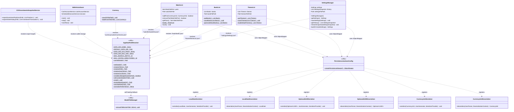

# OOP25-UniBodget — Persistency - UML Class Diagram
GitHub renders the diagram below automatically.

```mermaid
classDiagram
    direction TB

    %% ============================================================
    %% ============ CENTRAL PATH RESOLVER ===============
    %% ============================================================

    class AppDataPathResolver {
        <<utility>>
        -DATA_DIR_NAME : String$
        -DEFAULT_DATA_DIR : Path$
        -DATA_DIR_SYS_PROP : String$
        -DATA_DIR_ENV_VAR : String$
        -MAX_SEARCH_DEPTH : int$
        -MAX_VISITED_DIRECTORIES : int$
        -cachedDataDir : Path$
        +getDataDir()$ Path
        +resolve(String)$ Path
        +resolve(Path)$ Path
        +resolveJson(String)$ Path
        +resolveCsv(String)$ Path
        +isValidUniBodgetDataDir(Path)$ boolean
        +setCustomDataDir(Path)$ void
        +reset()$ void
        -resolveBaseDataDir()$ Path
        -scanSubtree(Path)$ Path
        -normalizePrefix(String)$ String
    }

    class ModelFileManager {
        <<utility>>
        +ensureFileExists(Path, String)$ void
    }

    AppDataPathResolver ..> ModelFileManager : self-healing fallback

    %% ============================================================
    %% ============ MANAGERS & REPOSITORIES =============
    %% ============================================================

    class SettingsManager {
        -Settings settings
        -List~SettingsSnapshot~ history
        -Path settingsFilePath
        +SettingsManager()
        +getSettings() Settings
        +saveSettings(Settings) void
        +getHistory() List~SettingsSnapshot~
        +restoreSnapshot(SettingsSnapshot) void
        -loadOrCreateSettings() Settings
    }

    class ThemeList {
        -List~Theme~ themes
        -Path themesFilePath
        +getThemes()$ List~Theme~
        +saveThemes(List~Theme~)$ void
        +loadDefaultThemes()$ List~Theme~
    }

    class BankList {
        -List~Bank~ banks
        -Path bankFilePath
        +getBanks()$ List~Bank~
        +saveBanks(List~Bank~)$ void
        +generateMockBanks()$ List~Bank~
    }

    class WatchList {
        -Set~WatchlistPair~ pairs
        -Path watchlistPath
        +addPair(CurrencyUnit, CurrencyUnit) boolean
        +removePair(WatchlistPair) boolean
        +getPairs() Set~WatchlistPair~
        +load()$ WatchList
        +save() void
    }

    class Currency {
        +saveToFile(Path)$ void
        +loadFromFile(Path)$ List~Currency~
    }

    SettingsManager ..> AppDataPathResolver : resolves "settings/Settings.json"
    ThemeList ..> AppDataPathResolver : resolves "theme/themeList.json"
    BankList ..> AppDataPathResolver : resolves "bank/banks.json"
    WatchList ..> AppDataPathResolver : resolves "watchlist/watchlist.json"
    Currency ..> AppDataPathResolver : resolves "currency/customCurrencies.json"

    %% ============================================================
    %% ============ SERIALIZATION LAYER (JACKSON) =================
    %% ============================================================

    class PersistenceJacksonConfig {
        <<utility>>
        +createPersistenceMapper()$ ObjectMapper
    }

    class LocalDateSerializer {
        +serialize(LocalDate, JsonGenerator, SerializerProvider) void
    }

    class LocalDateDeserializer {
        +deserialize(JsonParser, DeserializationContext) LocalDate
    }

    class OptionalUUIDSerializer {
        +serialize(Optional~UUID~, JsonGenerator, SerializerProvider) void
    }

    class OptionalUUIDDeserializer {
        +deserialize(JsonParser, DeserializationContext) Optional~UUID~
    }

    class CurrencyUnitSerializer {
        +serialize(CurrencyUnit, JsonGenerator, SerializerProvider) void
    }

    class CurrencyUnitDeserializer {
        +deserialize(JsonParser, DeserializationContext) CurrencyUnit
    }

    PersistenceJacksonConfig ..> LocalDateSerializer : registers
    PersistenceJacksonConfig ..> LocalDateDeserializer : registers
    PersistenceJacksonConfig ..> OptionalUUIDSerializer : registers
    PersistenceJacksonConfig ..> OptionalUUIDDeserializer : registers
    PersistenceJacksonConfig ..> CurrencyUnitSerializer : registers
    PersistenceJacksonConfig ..> CurrencyUnitDeserializer : registers

    SettingsManager ..> PersistenceJacksonConfig : uses ObjectMapper
    ThemeList ..> PersistenceJacksonConfig : uses ObjectMapper
    BankList ..> PersistenceJacksonConfig : uses ObjectMapper
    WatchList ..> PersistenceJacksonConfig : uses ObjectMapper

    %% ============================================================
    %% ============ WALLET & CSV PERSISTENCE ======================
    %% ============================================================

    class WalletAutoSaver {
        -CashAccountService cashAccountService
        -ScheduledExecutorService executor
        +start() void
        +stop() void
        +saveNow() void
    }

    class CSVInvestmentsSnapshotService {
        +exportInvestmentPositions(Path, List~Position~) void
        +exportOrderHistory(Path, List~InvestmentTransaction~) void
    }

    WalletAutoSaver ..> AppDataPathResolver : resolves wallet storage
    CSVInvestmentsSnapshotService ..> AppDataPathResolver : resolves export targets
```
