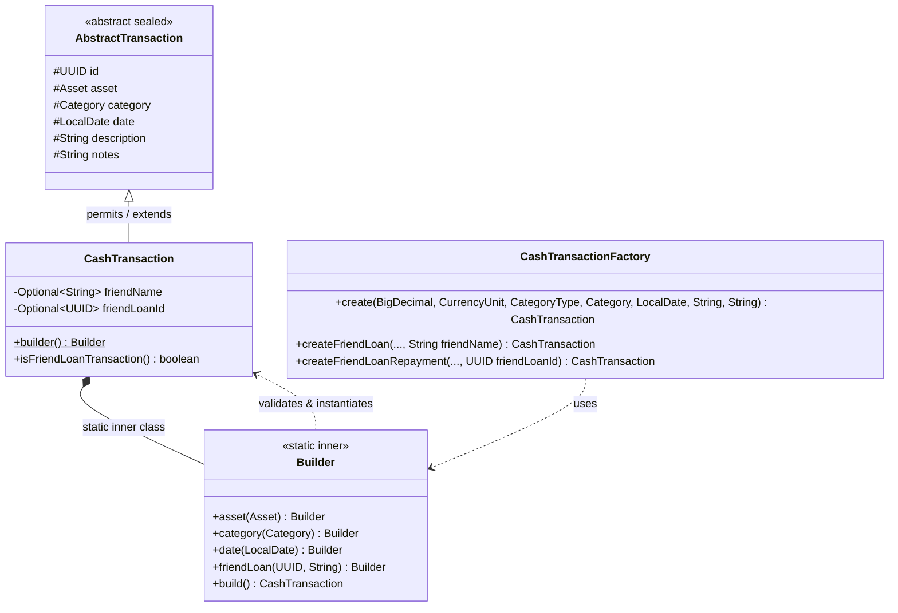

```mermaid
classDiagram
    direction TB

    class AbstractTransaction {
        <<abstract sealed>>
        #UUID id
        #Asset asset
        #Category category
        #LocalDate date
        #String description
        #String notes
    }

    class CashTransaction {
        -Optional~String~ friendName
        -Optional~UUID~ friendLoanId
        +builder()$ Builder
        +isFriendLoanTransaction() boolean
    }

    class Builder {
        <<static inner>>
        +asset(Asset) Builder
        +category(Category) Builder
        +date(LocalDate) Builder
        +friendLoan(UUID, String) Builder
        +build() CashTransaction
    }

    class CashTransactionFactory {
        +create(BigDecimal, CurrencyUnit, CategoryType, Category, LocalDate, String, String) CashTransaction
        +createFriendLoan(..., String friendName) CashTransaction
        +createFriendLoanRepayment(..., UUID friendLoanId) CashTransaction
    }

    AbstractTransaction <|-- CashTransaction : permits / extends
    CashTransaction *-- Builder : static inner class
    Builder ..> CashTransaction : validates & instantiates
    CashTransactionFactory ..> Builder : uses
```
