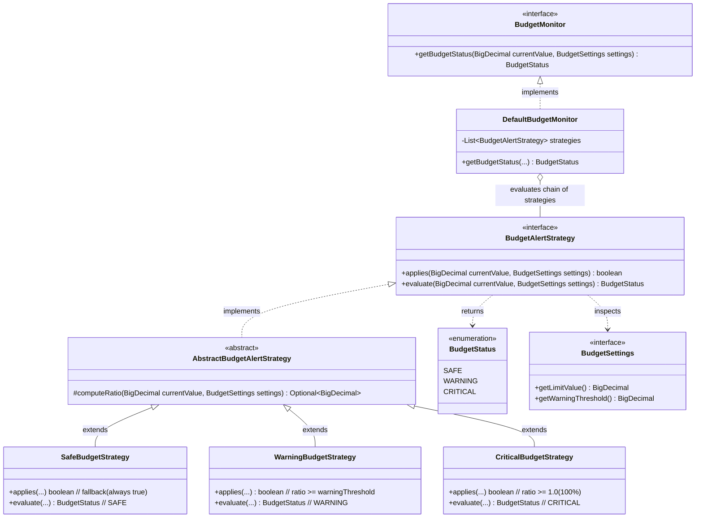

```mermaid
classDiagram
    direction TB

    class BudgetMonitor {
        <<interface>>
        +getBudgetStatus(BigDecimal currentValue, BudgetSettings settings) BudgetStatus
    }

    class DefaultBudgetMonitor {
        -List~BudgetAlertStrategy~ strategies
        +getBudgetStatus(...) BudgetStatus
    }

    class BudgetAlertStrategy {
        <<interface>>
        +applies(BigDecimal currentValue, BudgetSettings settings) boolean
        +evaluate(BigDecimal currentValue, BudgetSettings settings) BudgetStatus
    }

    class AbstractBudgetAlertStrategy {
        <<abstract>>
        #computeRatio(BigDecimal currentValue, BudgetSettings settings) Optional~BigDecimal~
    }

    class SafeBudgetStrategy {
        +applies(...) boolean // fallback (always true)
        +evaluate(...) BudgetStatus // SAFE
    }

    class WarningBudgetStrategy {
        +applies(...) boolean // ratio >= warningThreshold
        +evaluate(...) BudgetStatus // WARNING
    }

    class CriticalBudgetStrategy {
        +applies(...) boolean // ratio >= 1.0 (100%)
        +evaluate(...) BudgetStatus // CRITICAL
    }

    class BudgetStatus {
        <<enumeration>>
        SAFE
        WARNING
        CRITICAL
    }

    class BudgetSettings {
        <<interface>>
        +getLimitValue() BigDecimal
        +getWarningThreshold() BigDecimal
    }

    BudgetMonitor <|.. DefaultBudgetMonitor : implements
    DefaultBudgetMonitor o-- BudgetAlertStrategy : evaluates chain of strategies
    BudgetAlertStrategy <|.. AbstractBudgetAlertStrategy : implements
    AbstractBudgetAlertStrategy <|-- SafeBudgetStrategy : extends
    AbstractBudgetAlertStrategy <|-- WarningBudgetStrategy : extends
    AbstractBudgetAlertStrategy <|-- CriticalBudgetStrategy : extends
    BudgetAlertStrategy ..> BudgetStatus : returns
    BudgetAlertStrategy ..> BudgetSettings : inspects
```
