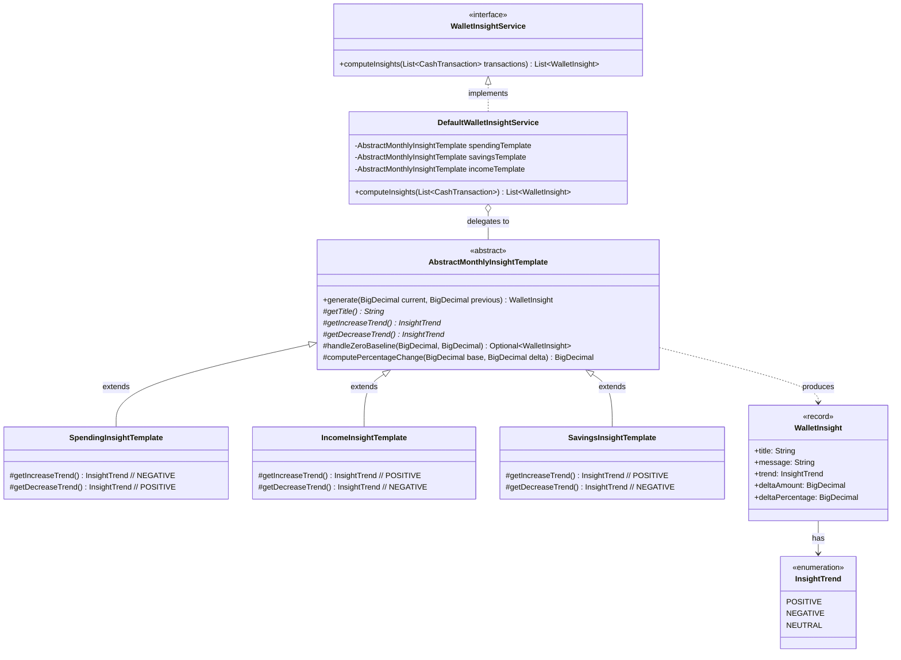

```mermaid
classDiagram
    direction TB

    class WalletInsightService {
        <<interface>>
        +computeInsights(List~CashTransaction~ transactions) List~WalletInsight~
    }

    class DefaultWalletInsightService {
        -AbstractMonthlyInsightTemplate spendingTemplate
        -AbstractMonthlyInsightTemplate savingsTemplate
        -AbstractMonthlyInsightTemplate incomeTemplate
        +computeInsights(List~CashTransaction~) List~WalletInsight~
    }

    class AbstractMonthlyInsightTemplate {
        <<abstract>>
        +generate(BigDecimal current, BigDecimal previous) WalletInsight
        #getTitle()* String
        #getIncreaseTrend()* InsightTrend
        #getDecreaseTrend()* InsightTrend
        #handleZeroBaseline(BigDecimal, BigDecimal) Optional~WalletInsight~
        #computePercentageChange(BigDecimal base, BigDecimal delta) BigDecimal
    }

    class SpendingInsightTemplate {
        #getIncreaseTrend() InsightTrend // NEGATIVE
        #getDecreaseTrend() InsightTrend // POSITIVE
    }

    class IncomeInsightTemplate {
        #getIncreaseTrend() InsightTrend // POSITIVE
        #getDecreaseTrend() InsightTrend // NEGATIVE
    }

    class SavingsInsightTemplate {
        #getIncreaseTrend() InsightTrend // POSITIVE
        #getDecreaseTrend() InsightTrend // NEGATIVE
    }

    class WalletInsight {
        <<record>>
        +title: String
        +message: String
        +trend: InsightTrend
        +deltaAmount: BigDecimal
        +deltaPercentage: BigDecimal
    }

    class InsightTrend {
        <<enumeration>>
        POSITIVE
        NEGATIVE
        NEUTRAL
    }

    WalletInsightService <|.. DefaultWalletInsightService : implements
    DefaultWalletInsightService o-- AbstractMonthlyInsightTemplate : delegates to
    AbstractMonthlyInsightTemplate <|-- SpendingInsightTemplate : extends
    AbstractMonthlyInsightTemplate <|-- IncomeInsightTemplate : extends
    AbstractMonthlyInsightTemplate <|-- SavingsInsightTemplate : extends
    AbstractMonthlyInsightTemplate ..> WalletInsight : produces
    WalletInsight --> InsightTrend : has
```
