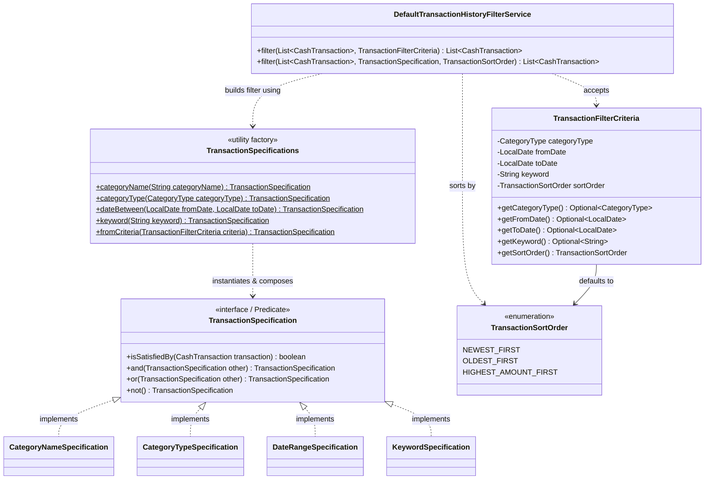

```mermaid
classDiagram
    direction TB

    class TransactionSpecification {
        <<interface / Predicate>>
        +isSatisfiedBy(CashTransaction transaction) boolean
        +and(TransactionSpecification other) TransactionSpecification
        +or(TransactionSpecification other) TransactionSpecification
        +not() TransactionSpecification
    }

    class CategoryNameSpecification
    class CategoryTypeSpecification
    class DateRangeSpecification
    class KeywordSpecification

    class TransactionSpecifications {
        <<utility factory>>
        +categoryName(String categoryName)$ TransactionSpecification
        +categoryType(CategoryType categoryType)$ TransactionSpecification
        +dateBetween(LocalDate fromDate, LocalDate toDate)$ TransactionSpecification
        +keyword(String keyword)$ TransactionSpecification
        +fromCriteria(TransactionFilterCriteria criteria)$ TransactionSpecification
    }

    class DefaultTransactionHistoryFilterService {
        +filter(List~CashTransaction~, TransactionFilterCriteria) List~CashTransaction~
        +filter(List~CashTransaction~, TransactionSpecification, TransactionSortOrder) List~CashTransaction~
    }

    class TransactionFilterCriteria {
        -CategoryType categoryType
        -LocalDate fromDate
        -LocalDate toDate
        -String keyword
        -TransactionSortOrder sortOrder
        +getCategoryType() Optional~CategoryType~
        +getFromDate() Optional~LocalDate~
        +getToDate() Optional~LocalDate~
        +getKeyword() Optional~String~
        +getSortOrder() TransactionSortOrder
    }

    class TransactionSortOrder {
        <<enumeration>>
        NEWEST_FIRST
        OLDEST_FIRST
        HIGHEST_AMOUNT_FIRST
    }

    TransactionSpecification <|.. CategoryNameSpecification : implements
    TransactionSpecification <|.. CategoryTypeSpecification : implements
    TransactionSpecification <|.. DateRangeSpecification : implements
    TransactionSpecification <|.. KeywordSpecification : implements

    TransactionSpecifications ..> TransactionSpecification : instantiates & composes
    DefaultTransactionHistoryFilterService ..> TransactionSpecifications : builds filter using
    DefaultTransactionHistoryFilterService ..> TransactionFilterCriteria : accepts
    DefaultTransactionHistoryFilterService ..> TransactionSortOrder : sorts by
    TransactionFilterCriteria --> TransactionSortOrder : defaults to
```
