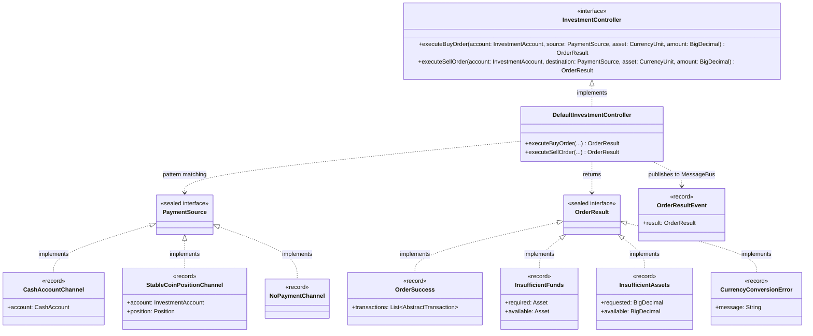

# OOP25-UniBodget — Figura 2.14: Ordini e Sorgenti di Pagamento (Tipi Sigillati)

```mermaid
classDiagram
direction TB

class PaymentSource {
    <<sealed interface>>
}

class CashAccountChannel {
    <<record>>
    +account: CashAccount
}

class StableCoinPositionChannel {
    <<record>>
    +account: InvestmentAccount
    +position: Position
}

class NoPaymentChannel {
    <<record>>
}

PaymentSource <|.. CashAccountChannel : implements
PaymentSource <|.. StableCoinPositionChannel : implements
PaymentSource <|.. NoPaymentChannel : implements

class OrderResult {
    <<sealed interface>>
}

class OrderSuccess {
    <<record>>
    +transactions: List~AbstractTransaction~
}

class InsufficientFunds {
    <<record>>
    +required: Asset
    +available: Asset
}

class InsufficientAssets {
    <<record>>
    +requested: BigDecimal
    +available: BigDecimal
}

class CurrencyConversionError {
    <<record>>
    +message: String
}

OrderResult <|.. OrderSuccess : implements
OrderResult <|.. InsufficientFunds : implements
OrderResult <|.. InsufficientAssets : implements
OrderResult <|.. CurrencyConversionError : implements

class InvestmentController {
    <<interface>>
    +executeBuyOrder(account: InvestmentAccount, source: PaymentSource, asset: CurrencyUnit, amount: BigDecimal) OrderResult
    +executeSellOrder(account: InvestmentAccount, destination: PaymentSource, asset: CurrencyUnit, amount: BigDecimal) OrderResult
}

class DefaultInvestmentController {
    +executeBuyOrder(...) OrderResult
    +executeSellOrder(...) OrderResult
}

class OrderResultEvent {
    <<record>>
    +result: OrderResult
}

InvestmentController <|.. DefaultInvestmentController : implements
DefaultInvestmentController ..> PaymentSource : pattern matching
DefaultInvestmentController ..> OrderResult : returns
DefaultInvestmentController ..> OrderResultEvent : publishes to MessageBus
```

