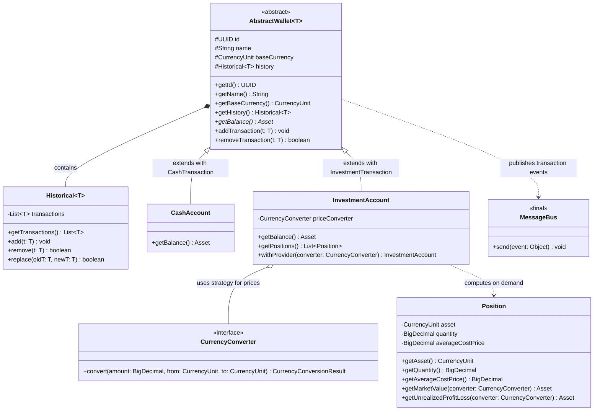

# OOP25-UniBodget — Figura 2.15: Saldo e Posizioni Calcolati dallo Storico (Template Method)

```mermaid
classDiagram
direction TB

class AbstractWallet~T~ {
    <<abstract>>
    #UUID id
    #String name
    #CurrencyUnit baseCurrency
    #Historical~T~ history
    +getId() UUID
    +getName() String
    +getBaseCurrency() CurrencyUnit
    +getHistory() Historical~T~
    +getBalance()* Asset
    +addTransaction(t: T) void
    +removeTransaction(t: T) boolean
}

class Historical~T~ {
    -List~T~ transactions
    +getTransactions() List~T~
    +add(t: T) void
    +remove(t: T) boolean
    +replace(oldT: T, newT: T) boolean
}

class CashAccount {
    +getBalance() Asset
}

class InvestmentAccount {
    -CurrencyConverter priceConverter
    +getBalance() Asset
    +getPositions() List~Position~
    +withProvider(converter: CurrencyConverter) InvestmentAccount
}

class Position {
    -CurrencyUnit asset
    -BigDecimal quantity
    -BigDecimal averageCostPrice
    +getAsset() CurrencyUnit
    +getQuantity() BigDecimal
    +getAverageCostPrice() BigDecimal
    +getMarketValue(converter: CurrencyConverter) Asset
    +getUnrealizedProfitLoss(converter: CurrencyConverter) Asset
}

class CurrencyConverter {
    <<interface>>
    +convert(amount: BigDecimal, from: CurrencyUnit, to: CurrencyUnit) CurrencyConversionResult
}

class MessageBus {
    <<final>>
    +send(event: Object) void
}

AbstractWallet <|-- CashAccount : extends with CashTransaction
AbstractWallet <|-- InvestmentAccount : extends with InvestmentTransaction

AbstractWallet *-- Historical : contains
InvestmentAccount o-- CurrencyConverter : uses strategy for prices
InvestmentAccount ..> Position : computes on demand
AbstractWallet ..> MessageBus : publishes transaction events
```

