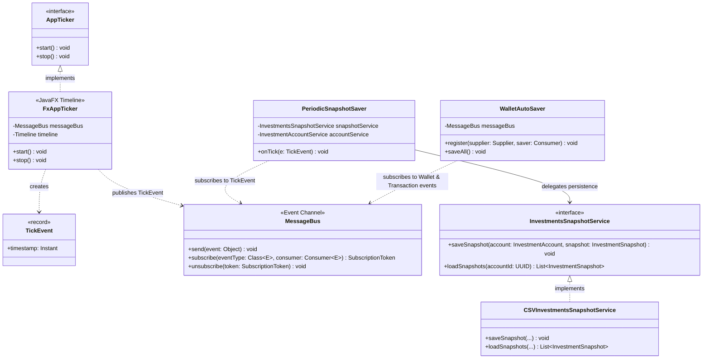

# OOP25-UniBodget — Figura 2.16: Eventi, Tempo dell'Applicazione e Salvataggi Automatici

```mermaid
classDiagram
direction TB

class AppTicker {
    <<interface>>
    +start() void
    +stop() void
}

class FxAppTicker {
    <<JavaFX Timeline>>
    -MessageBus messageBus
    -Timeline timeline
    +start() void
    +stop() void
}

class TickEvent {
    <<record>>
    +timestamp: Instant
}

class MessageBus {
    <<Event Channel>>
    +send(event: Object) void
    +subscribe(eventType: Class~E~, consumer: Consumer~E~) SubscriptionToken
    +unsubscribe(token: SubscriptionToken) void
}

class PeriodicSnapshotSaver {
    -InvestmentsSnapshotService snapshotService
    -InvestmentAccountService accountService
    +onTick(e: TickEvent) void
}

class InvestmentsSnapshotService {
    <<interface>>
    +saveSnapshot(account: InvestmentAccount, snapshot: InvestmentSnapshot) void
    +loadSnapshots(accountId: UUID) List~InvestmentSnapshot~
}

class CSVInvestmentsSnapshotService {
    +saveSnapshot(...) void
    +loadSnapshots(...) List~InvestmentSnapshot~
}

class WalletAutoSaver {
    -MessageBus messageBus
    +register(supplier: Supplier, saver: Consumer) void
    +saveAll() void
}

AppTicker <|.. FxAppTicker : implements
FxAppTicker ..> MessageBus : publishes TickEvent
FxAppTicker ..> TickEvent : creates

PeriodicSnapshotSaver ..> MessageBus : subscribes to TickEvent
PeriodicSnapshotSaver --> InvestmentsSnapshotService : delegates persistence
InvestmentsSnapshotService <|.. CSVInvestmentsSnapshotService : implements

WalletAutoSaver ..> MessageBus : subscribes to Wallet & Transaction events
```

