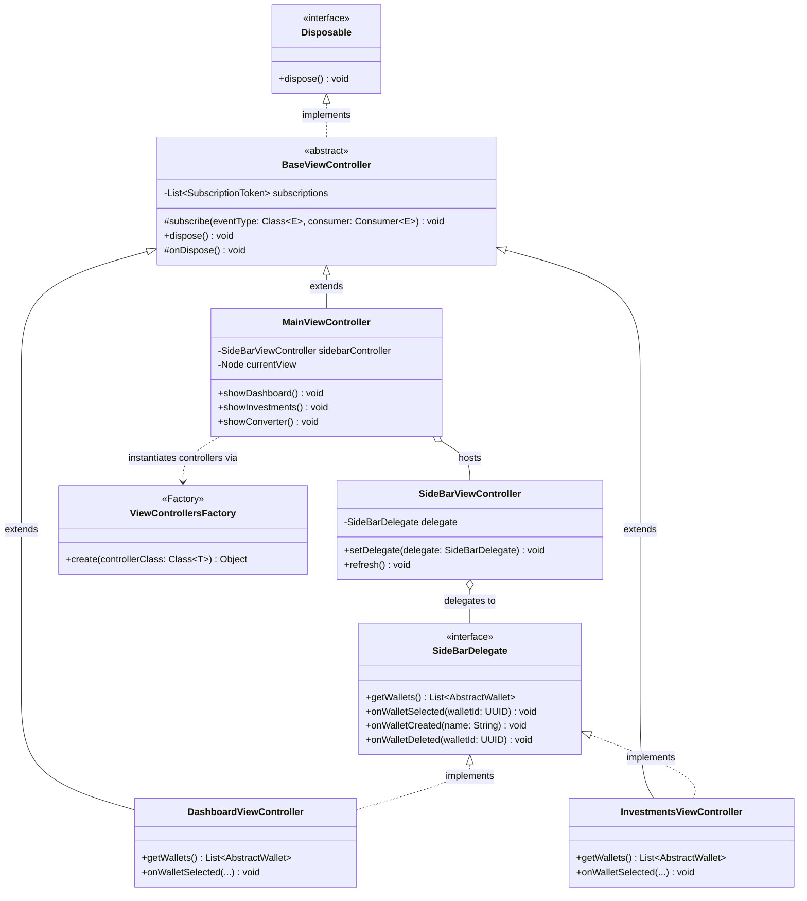

# OOP25-UniBodget — Figura 2.17: Finestra Principale, Barra Laterale con Delegate e Ciclo di Vita

```mermaid
classDiagram
direction TB

class Disposable {
    <<interface>>
    +dispose() void
}

class BaseViewController {
    <<abstract>>
    -List~SubscriptionToken~ subscriptions
    #subscribe(eventType: Class~E~, consumer: Consumer~E~) void
    +dispose() void
    #onDispose() void
}

class MainViewController {
    -SideBarViewController sidebarController
    -Node currentView
    +showDashboard() void
    +showInvestments() void
    +showConverter() void
}

class SideBarViewController {
    -SideBarDelegate delegate
    +setDelegate(delegate: SideBarDelegate) void
    +refresh() void
}

class SideBarDelegate {
    <<interface>>
    +getWallets() List~AbstractWallet~
    +onWalletSelected(walletId: UUID) void
    +onWalletCreated(name: String) void
    +onWalletDeleted(walletId: UUID) void
}

class DashboardViewController {
    +getWallets() List~AbstractWallet~
    +onWalletSelected(...) void
}

class InvestmentsViewController {
    +getWallets() List~AbstractWallet~
    +onWalletSelected(...) void
}

class ViewControllersFactory {
    <<Factory>>
    +create(controllerClass: Class~T~) Object
}

Disposable <|.. BaseViewController : implements
BaseViewController <|-- MainViewController : extends
BaseViewController <|-- DashboardViewController : extends
BaseViewController <|-- InvestmentsViewController : extends

MainViewController o-- SideBarViewController : hosts
SideBarViewController o-- SideBarDelegate : delegates to

SideBarDelegate <|.. DashboardViewController : implements
SideBarDelegate <|.. InvestmentsViewController : implements

MainViewController ..> ViewControllersFactory : instantiates controllers via
```

