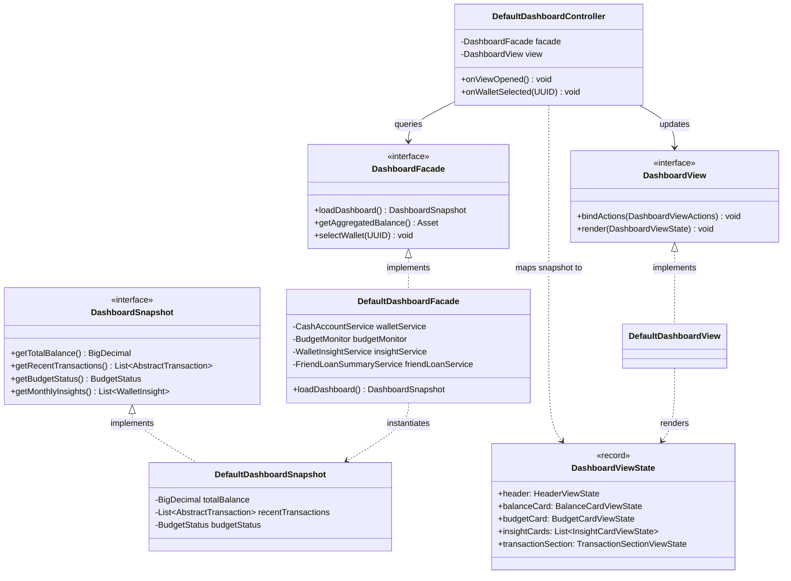

```mermaid
classDiagram
    direction TB

    class DashboardFacade {
        <<interface>>
        +loadDashboard() DashboardSnapshot
        +getAggregatedBalance() Asset
        +selectWallet(UUID) void
    }

    class DefaultDashboardFacade {
        -CashAccountService walletService
        -BudgetMonitor budgetMonitor
        -WalletInsightService insightService
        -FriendLoanSummaryService friendLoanService
        +loadDashboard() DashboardSnapshot
    }

    class DashboardSnapshot {
        <<interface>>
        +getTotalBalance() BigDecimal
        +getRecentTransactions() List~AbstractTransaction~
        +getBudgetStatus() BudgetStatus
        +getMonthlyInsights() List~WalletInsight~
    }

    class DefaultDashboardSnapshot {
        -BigDecimal totalBalance
        -List~AbstractTransaction~ recentTransactions
        -BudgetStatus budgetStatus
    }

    class DefaultDashboardController {
        -DashboardFacade facade
        -DashboardView view
        +onViewOpened() void
        +onWalletSelected(UUID) void
    }

    class DashboardView {
        <<interface>>
        +bindActions(DashboardViewActions) void
        +render(DashboardViewState) void
    }

    class DefaultDashboardView

    class DashboardViewState {
        <<record>>
        +header: HeaderViewState
        +balanceCard: BalanceCardViewState
        +budgetCard: BudgetCardViewState
        +insightCards: List~InsightCardViewState~
        +transactionSection: TransactionSectionViewState
    }

    DashboardFacade <|.. DefaultDashboardFacade : implements
    DashboardSnapshot <|.. DefaultDashboardSnapshot : implements
    DefaultDashboardFacade ..> DefaultDashboardSnapshot : instantiates
    DefaultDashboardController --> DashboardFacade : queries
    DefaultDashboardController --> DashboardView : updates
    DashboardView <|.. DefaultDashboardView : implements
    DefaultDashboardController ..> DashboardViewState : maps snapshot to
    DefaultDashboardView ..> DashboardViewState : renders
```
