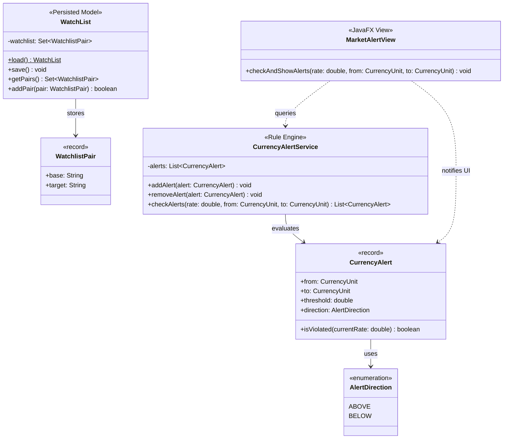

# OOP25-UniBodget — Figura 2.4: Alert e Watchlist

```mermaid
classDiagram
direction TB

class CurrencyAlert {
    <<record>>
    +from: CurrencyUnit
    +to: CurrencyUnit
    +threshold: double
    +direction: AlertDirection
    +isViolated(currentRate: double) boolean
}

class AlertDirection {
    <<enumeration>>
    ABOVE
    BELOW
}

class CurrencyAlertService {
    <<Rule Engine>>
    -alerts: List~CurrencyAlert~
    +addAlert(alert: CurrencyAlert) void
    +removeAlert(alert: CurrencyAlert) void
    +checkAlerts(rate: double, from: CurrencyUnit, to: CurrencyUnit) List~CurrencyAlert~
}

class WatchList {
    <<Persisted Model>>
    -watchlist: Set~WatchlistPair~
    +load()$ WatchList
    +save() void
    +getPairs() Set~WatchlistPair~
    +addPair(pair: WatchlistPair) boolean
}

class WatchlistPair {
    <<record>>
    +base: String
    +target: String
}

class MarketAlertView {
    <<JavaFX View>>
    +checkAndShowAlerts(rate: double, from: CurrencyUnit, to: CurrencyUnit) void
}

CurrencyAlert --> AlertDirection : uses
CurrencyAlertService --> CurrencyAlert : evaluates
WatchList --> WatchlistPair : stores
MarketAlertView ..> CurrencyAlertService : queries
MarketAlertView ..> CurrencyAlert : notifies UI
```
