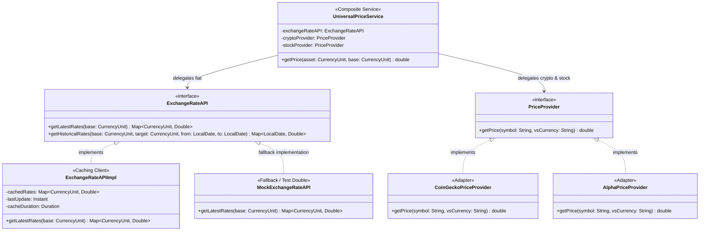

```mermaid
classDiagram
direction TB

class ExchangeRateAPI {
    <<interface>>
    +getLatestRates(base: CurrencyUnit) Map~CurrencyUnit, Double~
    +getHistoricalRates(base: CurrencyUnit, target: CurrencyUnit, from: LocalDate, to: LocalDate) Map~LocalDate, Double~
}

class ExchangeRateAPIImpl {
    <<Caching Client>>
    -cachedRates: Map~CurrencyUnit, Double~
    -lastUpdate: Instant
    -cacheDuration: Duration
    +getLatestRates(base: CurrencyUnit) Map~CurrencyUnit, Double~
}

class MockExchangeRateAPI {
    <<Fallback / Test Double>>
    +getLatestRates(base: CurrencyUnit) Map~CurrencyUnit, Double~
}

class UniversalPriceService {
    <<Composite Service>>
    -exchangeRateAPI: ExchangeRateAPI
    -cryptoProvider: PriceProvider
    -stockProvider: PriceProvider
    +getPrice(asset: CurrencyUnit, base: CurrencyUnit) double
}

class PriceProvider {
    <<interface>>
    +getPrice(symbol: String, vsCurrency: String) double
}

class CoinGeckoPriceProvider {
    <<Adapter>>
    +getPrice(symbol: String, vsCurrency: String) double
}

class AlphaPriceProvider {
    <<Adapter>>
    +getPrice(symbol: String, vsCurrency: String) double
}

ExchangeRateAPI <|.. ExchangeRateAPIImpl : implements
ExchangeRateAPI <|.. MockExchangeRateAPI : fallback implementation

UniversalPriceService --> ExchangeRateAPI : delegates fiat
UniversalPriceService --> PriceProvider : delegates crypto & stock

PriceProvider <|.. CoinGeckoPriceProvider : implements
PriceProvider <|.. AlphaPriceProvider : implements
```

