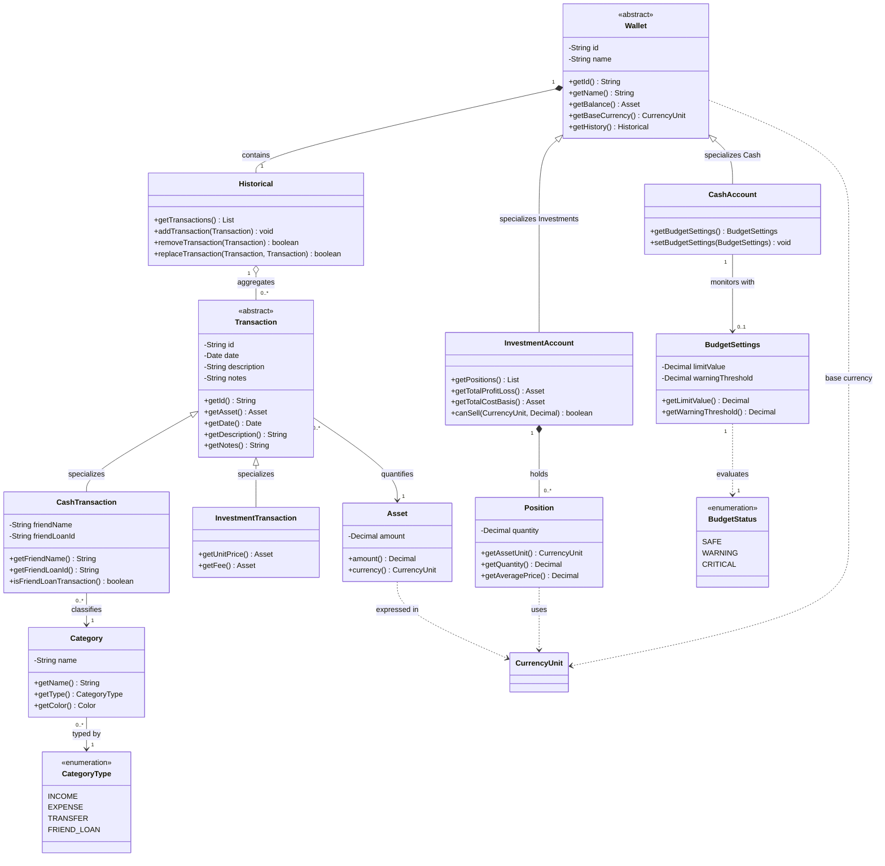

# OOP25-UniBodget — Schema UML del Dominio (Parte 1: Conti, Storico e Budget)

```mermaid
classDiagram
direction TB

class Wallet {
    <<abstract>>
    -String id
    -String name
    +getId() String
    +getName() String
    +getBalance() Asset
    +getBaseCurrency() CurrencyUnit
    +getHistory() Historical
}

class Historical {
    +getTransactions() List
    +addTransaction(Transaction) void
    +removeTransaction(Transaction) boolean
    +replaceTransaction(Transaction, Transaction) boolean
}

class CashAccount {
    +getBudgetSettings() BudgetSettings
    +setBudgetSettings(BudgetSettings) void
}

class InvestmentAccount {
    +getPositions() List
    +getTotalProfitLoss() Asset
    +getTotalCostBasis() Asset
    +canSell(CurrencyUnit, Decimal) boolean
}

class Transaction {
    <<abstract>>
    -String id
    -Date date
    -String description
    -String notes
    +getId() String
    +getAsset() Asset
    +getDate() Date
    +getDescription() String
    +getNotes() String
}

class CashTransaction {
    -String friendName
    -String friendLoanId
    +getFriendName() String
    +getFriendLoanId() String
    +isFriendLoanTransaction() boolean
}

class InvestmentTransaction {
    +getUnitPrice() Asset
    +getFee() Asset
}

class Asset {
    -Decimal amount
    +amount() Decimal
    +currency() CurrencyUnit
}

class Position {
    -Decimal quantity
    +getAssetUnit() CurrencyUnit
    +getQuantity() Decimal
    +getAveragePrice() Decimal
}

class Category {
    -String name
    +getName() String
    +getType() CategoryType
    +getColor() Color
}

class CategoryType {
    <<enumeration>>
    INCOME
    EXPENSE
    TRANSFER
    FRIEND_LOAN
}

class BudgetSettings {
    -Decimal limitValue
    -Decimal warningThreshold
    +getLimitValue() Decimal
    +getWarningThreshold() Decimal
}

class BudgetStatus {
    <<enumeration>>
    SAFE
    WARNING
    CRITICAL
}

Wallet <|-- CashAccount : specializes Cash
Wallet <|-- InvestmentAccount : specializes Investments

Wallet "1" *-- "1" Historical : contains
Historical "1" o-- "0..*" Transaction : aggregates

Transaction <|-- CashTransaction : specializes
Transaction <|-- InvestmentTransaction : specializes

Transaction "0..*" --> "1" Asset : quantifies

InvestmentAccount "1" *-- "0..*" Position : holds

CashAccount "1" --> "0..1" BudgetSettings : monitors with
BudgetSettings "1" ..> "1" BudgetStatus : evaluates

CashTransaction "0..*" --> "1" Category : classifies
Category "0..*" --> "1" CategoryType : typed by

Asset ..> CurrencyUnit : expressed in
Position ..> CurrencyUnit : uses
Wallet ..> CurrencyUnit : base currency
```
