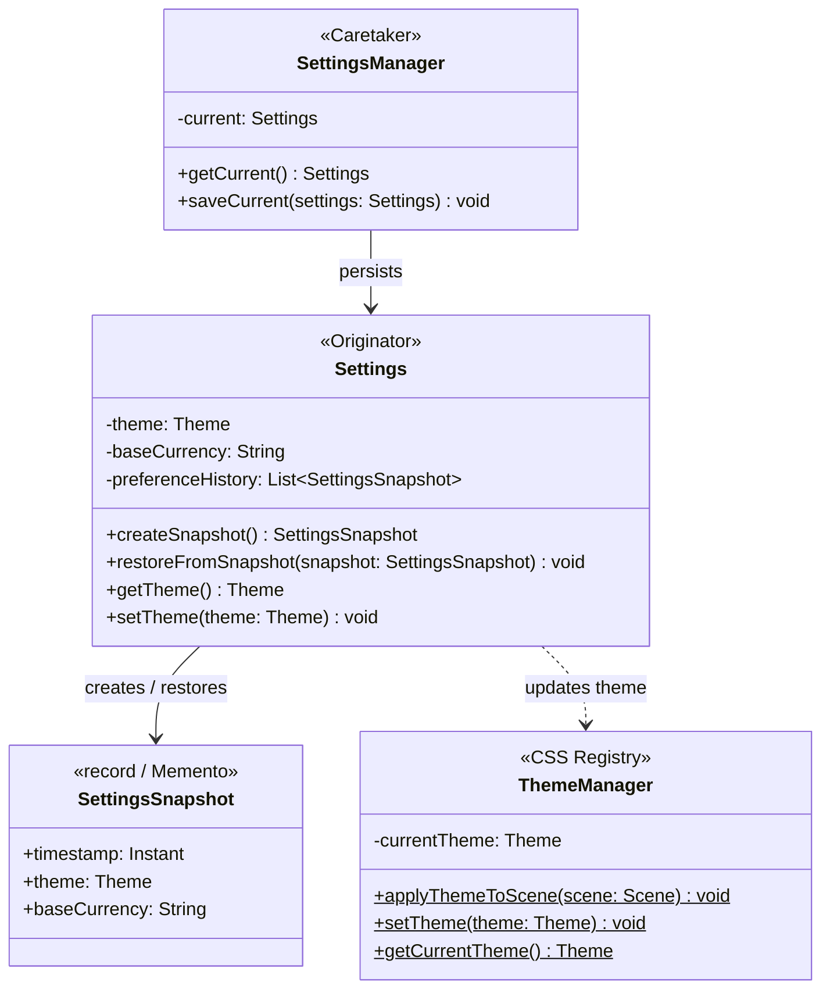

# OOP25-UniBodget — Figura 2.5: Memento Pattern e ThemeManager

```mermaid
classDiagram
direction TB

class SettingsManager {
    <<Caretaker>>
    -current: Settings
    +getCurrent() Settings
    +saveCurrent(settings: Settings) void
}

class Settings {
    <<Originator>>
    -theme: Theme
    -baseCurrency: String
    -preferenceHistory: List~SettingsSnapshot~
    +createSnapshot() SettingsSnapshot
    +restoreFromSnapshot(snapshot: SettingsSnapshot) void
    +getTheme() Theme
    +setTheme(theme: Theme) void
}

class SettingsSnapshot {
    <<record / Memento>>
    +timestamp: Instant
    +theme: Theme
    +baseCurrency: String
}

class ThemeManager {
    <<CSS Registry>>
    -currentTheme: Theme
    +applyThemeToScene(scene: Scene)$ void
    +setTheme(theme: Theme)$ void
    +getCurrentTheme()$ Theme
}

SettingsManager --> Settings : persists
Settings --> SettingsSnapshot : creates / restores
Settings ..> ThemeManager : updates theme
```
