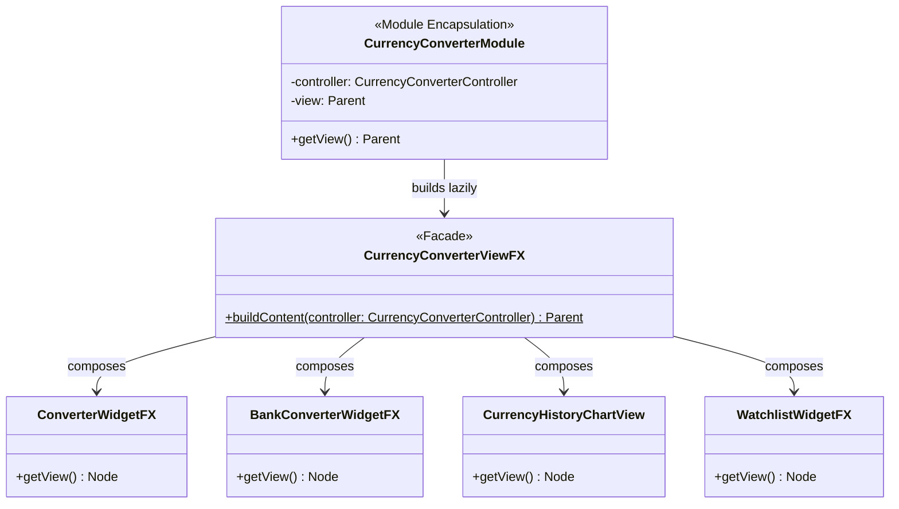

# OOP25-UniBodget — Figura 2.6: Vista Convertitore e Composizione Modulare

```mermaid
classDiagram
direction TB

class CurrencyConverterModule {
    <<Module Encapsulation>>
    -controller: CurrencyConverterController
    -view: Parent
    +getView() Parent
}

class CurrencyConverterViewFX {
    <<Facade>>
    +buildContent(controller: CurrencyConverterController)$ Parent
}

class ConverterWidgetFX {
    +getView() Node
}

class BankConverterWidgetFX {
    +getView() Node
}

class CurrencyHistoryChartView {
    +getView() Node
}

class WatchlistWidgetFX {
    +getView() Node
}

CurrencyConverterModule --> CurrencyConverterViewFX : builds lazily
CurrencyConverterViewFX --> ConverterWidgetFX : composes
CurrencyConverterViewFX --> BankConverterWidgetFX : composes
CurrencyConverterViewFX --> CurrencyHistoryChartView : composes
CurrencyConverterViewFX --> WatchlistWidgetFX : composes
```
