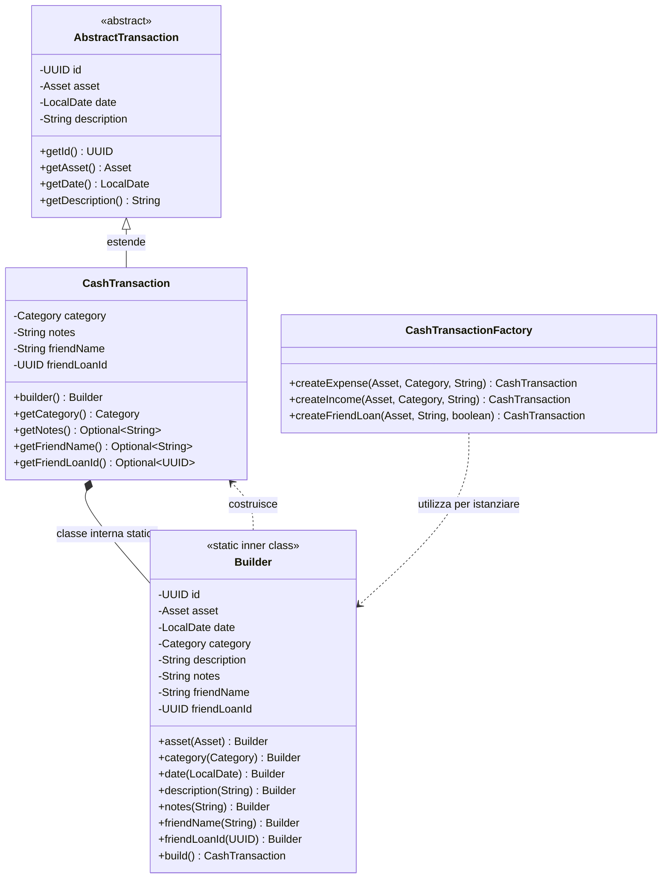

```mermaid
classDiagram
direction TB

class AbstractTransaction {
  <<abstract>>
  -UUID id
  -Asset asset
  -LocalDate date
  -String description
  +getId() UUID
  +getAsset() Asset
  +getDate() LocalDate
  +getDescription() String
}

class CashTransaction {
  -Category category
  -String notes
  -String friendName
  -UUID friendLoanId
  +builder() Builder
  +getCategory() Category
  +getNotes() Optional~String~
  +getFriendName() Optional~String~
  +getFriendLoanId() Optional~UUID~
}

class CashTransactionFactory {
  +createExpense(Asset, Category, String) CashTransaction
  +createIncome(Asset, Category, String) CashTransaction
  +createFriendLoan(Asset, String, boolean) CashTransaction
}

class Builder {
  <<static inner class>>
  -UUID id
  -Asset asset
  -LocalDate date
  -Category category
  -String description
  -String notes
  -String friendName
  -UUID friendLoanId
  +asset(Asset) Builder
  +category(Category) Builder
  +date(LocalDate) Builder
  +description(String) Builder
  +notes(String) Builder
  +friendName(String) Builder
  +friendLoanId(UUID) Builder
  +build() CashTransaction
}

AbstractTransaction <|-- CashTransaction : estende
CashTransaction *-- Builder : classe interna statica
CashTransactionFactory ..> Builder : utilizza per istanziare
Builder ..> CashTransaction : costruisce
```
