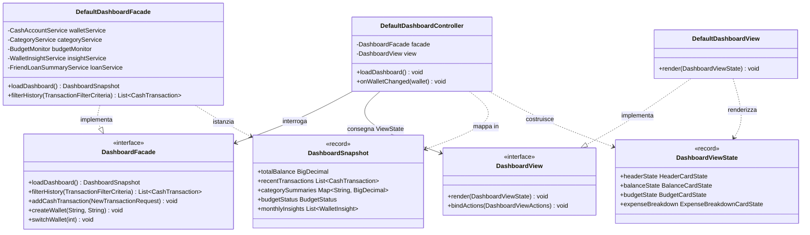

```mermaid
classDiagram
direction TB

class DefaultDashboardController {
  -DashboardFacade facade
  -DashboardView view
  +loadDashboard() void
  +onWalletChanged(wallet) void
}

class DashboardFacade {
  <<interface>>
  +loadDashboard() DashboardSnapshot
  +filterHistory(TransactionFilterCriteria) List~CashTransaction~
  +addCashTransaction(NewTransactionRequest) void
  +createWallet(String, String) void
  +switchWallet(int) void
}

class DashboardView {
  <<interface>>
  +render(DashboardViewState) void
  +bindActions(DashboardViewActions) void
}

class DefaultDashboardFacade {
  -CashAccountService walletService
  -CategoryService categoryService
  -BudgetMonitor budgetMonitor
  -WalletInsightService insightService
  -FriendLoanSummaryService loanService
  +loadDashboard() DashboardSnapshot
  +filterHistory(TransactionFilterCriteria) List~CashTransaction~
}

class DefaultDashboardView {
  +render(DashboardViewState) void
}

class DashboardSnapshot {
  <<record>>
  +totalBalance BigDecimal
  +recentTransactions List~CashTransaction~
  +categorySummaries Map~String, BigDecimal~
  +budgetStatus BudgetStatus
  +monthlyInsights List~WalletInsight~
}

class DashboardViewState {
  <<record>>
  +headerState HeaderCardState
  +balanceState BalanceCardState
  +budgetState BudgetCardState
  +expenseBreakdown ExpenseBreakdownCardState
}

DefaultDashboardController --> DashboardFacade : interroga
DefaultDashboardController --> DashboardView : consegna ViewState
DefaultDashboardFacade ..|> DashboardFacade : implementa
DefaultDashboardView ..|> DashboardView : implementa
DefaultDashboardFacade ..> DashboardSnapshot : istanzia
DefaultDashboardController ..> DashboardSnapshot : mappa in
DefaultDashboardController ..> DashboardViewState : costruisce
DefaultDashboardView ..> DashboardViewState : renderizza
```
