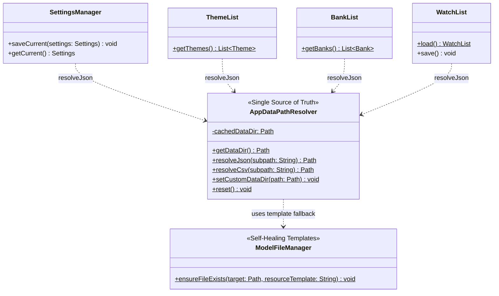

```mermaid
classDiagram
direction TB

class AppDataPathResolver {
    <<Single Source of Truth>>
    -cachedDataDir: Path$
    +getDataDir()$ Path
    +resolveJson(subpath: String)$ Path
    +resolveCsv(subpath: String)$ Path
    +setCustomDataDir(path: Path)$ void
    +reset()$ void
}

class SettingsManager {
    +saveCurrent(settings: Settings) void
    +getCurrent() Settings
}

class ThemeList {
    +getThemes()$ List~Theme~
}

class BankList {
    +getBanks()$ List~Bank~
}

class WatchList {
    +load()$ WatchList
    +save() void
}

class ModelFileManager {
    <<Self-Healing Templates>>
    +ensureFileExists(target: Path, resourceTemplate: String)$ void
}

SettingsManager ..> AppDataPathResolver : resolveJson
ThemeList ..> AppDataPathResolver : resolveJson
BankList ..> AppDataPathResolver : resolveJson
WatchList ..> AppDataPathResolver : resolveJson
AppDataPathResolver ..> ModelFileManager : uses template fallback
```

