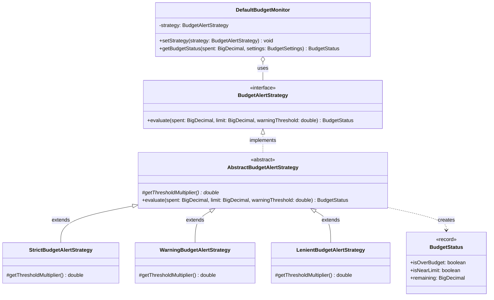

```mermaid
classDiagram
direction TB

class DefaultBudgetMonitor {
    -strategy: BudgetAlertStrategy
    +setStrategy(strategy: BudgetAlertStrategy) void
    +getBudgetStatus(spent: BigDecimal, settings: BudgetSettings) BudgetStatus
}

class BudgetAlertStrategy {
    <<interface>>
    +evaluate(spent: BigDecimal, limit: BigDecimal, warningThreshold: double) BudgetStatus
}

class AbstractBudgetAlertStrategy {
    <<abstract>>
    #getThresholdMultiplier()* double
    +evaluate(spent: BigDecimal, limit: BigDecimal, warningThreshold: double) BudgetStatus
}

class StrictBudgetAlertStrategy {
    #getThresholdMultiplier() double
}

class WarningBudgetAlertStrategy {
    #getThresholdMultiplier() double
}

class LenientBudgetAlertStrategy {
    #getThresholdMultiplier() double
}

class BudgetStatus {
    <<record>>
    +isOverBudget: boolean
    +isNearLimit: boolean
    +remaining: BigDecimal
}

DefaultBudgetMonitor o-- BudgetAlertStrategy : uses
BudgetAlertStrategy <|.. AbstractBudgetAlertStrategy : implements
AbstractBudgetAlertStrategy <|-- StrictBudgetAlertStrategy : extends
AbstractBudgetAlertStrategy <|-- WarningBudgetAlertStrategy : extends
AbstractBudgetAlertStrategy <|-- LenientBudgetAlertStrategy : extends
AbstractBudgetAlertStrategy ..> BudgetStatus : creates
```

