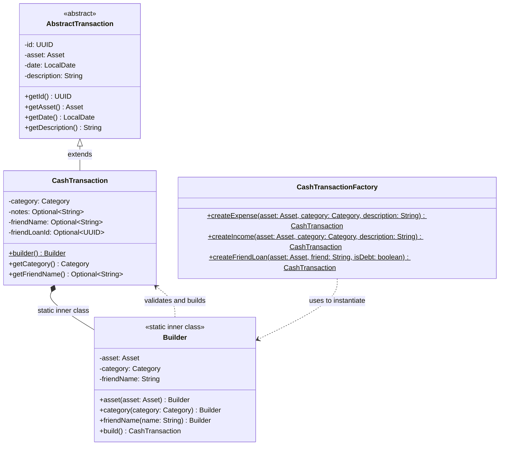

```mermaid
classDiagram
direction TB

class AbstractTransaction {
  <<abstract>>
  -id: UUID
  -asset: Asset
  -date: LocalDate
  -description: String
  +getId() UUID
  +getAsset() Asset
  +getDate() LocalDate
  +getDescription() String
}

class CashTransaction {
  -category: Category
  -notes: Optional~String~
  -friendName: Optional~String~
  -friendLoanId: Optional~UUID~
  +builder()$ Builder
  +getCategory() Category
  +getFriendName() Optional~String~
}

class CashTransactionFactory {
  +createExpense(asset: Asset, category: Category, description: String)$ CashTransaction
  +createIncome(asset: Asset, category: Category, description: String)$ CashTransaction
  +createFriendLoan(asset: Asset, friend: String, isDebt: boolean)$ CashTransaction
}

class Builder {
  <<static inner class>>
  -asset: Asset
  -category: Category
  -friendName: String
  +asset(asset: Asset) Builder
  +category(category: Category) Builder
  +friendName(name: String) Builder
  +build() CashTransaction
}

AbstractTransaction <|-- CashTransaction : extends
CashTransaction *-- Builder : static inner class
CashTransactionFactory ..> Builder : uses to instantiate
Builder ..> CashTransaction : validates and builds
```

