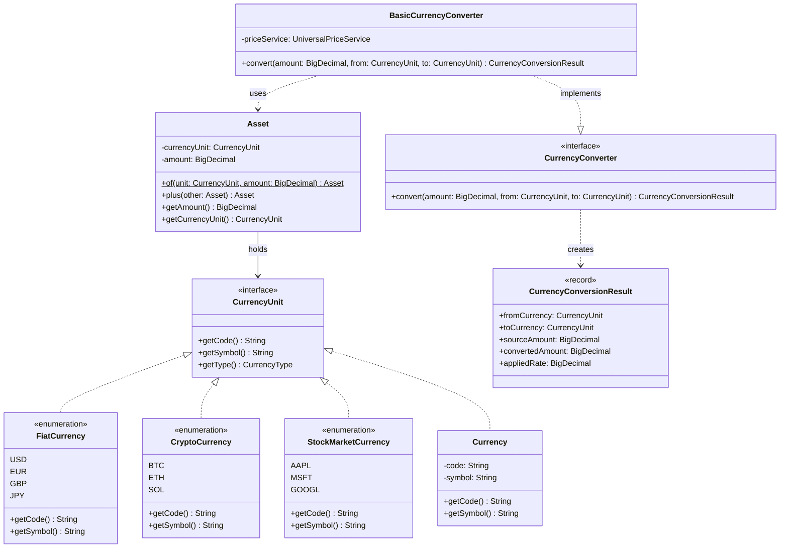

```mermaid
classDiagram
direction TB

class CurrencyUnit {
    <<interface>>
    +getCode() String
    +getSymbol() String
    +getType() CurrencyType
}

class FiatCurrency {
    <<enumeration>>
    USD
    EUR
    GBP
    JPY
    +getCode() String
    +getSymbol() String
}

class CryptoCurrency {
    <<enumeration>>
    BTC
    ETH
    SOL
    +getCode() String
    +getSymbol() String
}

class StockMarketCurrency {
    <<enumeration>>
    AAPL
    MSFT
    GOOGL
    +getCode() String
    +getSymbol() String
}

class Currency {
    -code: String
    -symbol: String
    +getCode() String
    +getSymbol() String
}

class Asset {
    -currencyUnit: CurrencyUnit
    -amount: BigDecimal
    +of(unit: CurrencyUnit, amount: BigDecimal)$ Asset
    +plus(other: Asset) Asset
    +getAmount() BigDecimal
    +getCurrencyUnit() CurrencyUnit
}

class CurrencyConverter {
    <<interface>>
    +convert(amount: BigDecimal, from: CurrencyUnit, to: CurrencyUnit) CurrencyConversionResult
}

class BasicCurrencyConverter {
    -priceService: UniversalPriceService
    +convert(amount: BigDecimal, from: CurrencyUnit, to: CurrencyUnit) CurrencyConversionResult
}

class CurrencyConversionResult {
    <<record>>
    +fromCurrency: CurrencyUnit
    +toCurrency: CurrencyUnit
    +sourceAmount: BigDecimal
    +convertedAmount: BigDecimal
    +appliedRate: BigDecimal
}

CurrencyUnit <|.. FiatCurrency
CurrencyUnit <|.. CryptoCurrency
CurrencyUnit <|.. StockMarketCurrency
CurrencyUnit <|.. Currency

Asset --> CurrencyUnit : holds
BasicCurrencyConverter ..|> CurrencyConverter : implements
CurrencyConverter ..> CurrencyConversionResult : creates
BasicCurrencyConverter ..> Asset : uses
```

