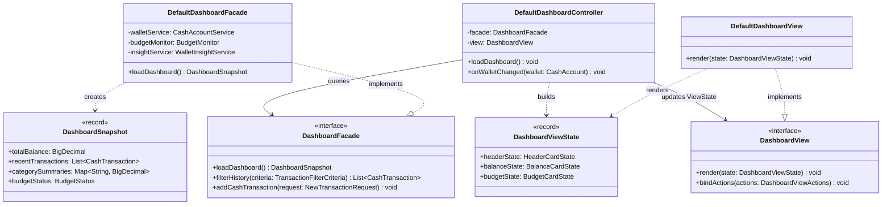

```mermaid
classDiagram
direction TB

class DefaultDashboardController {
  -facade: DashboardFacade
  -view: DashboardView
  +loadDashboard() void
  +onWalletChanged(wallet: CashAccount) void
}

class DashboardFacade {
  <<interface>>
  +loadDashboard() DashboardSnapshot
  +filterHistory(criteria: TransactionFilterCriteria) List~CashTransaction~
  +addCashTransaction(request: NewTransactionRequest) void
}

class DefaultDashboardFacade {
  -walletService: CashAccountService
  -budgetMonitor: BudgetMonitor
  -insightService: WalletInsightService
  +loadDashboard() DashboardSnapshot
}

class DashboardView {
  <<interface>>
  +render(state: DashboardViewState) void
  +bindActions(actions: DashboardViewActions) void
}

class DefaultDashboardView {
  +render(state: DashboardViewState) void
}

class DashboardSnapshot {
  <<record>>
  +totalBalance: BigDecimal
  +recentTransactions: List~CashTransaction~
  +categorySummaries: Map~String, BigDecimal~
  +budgetStatus: BudgetStatus
}

class DashboardViewState {
  <<record>>
  +headerState: HeaderCardState
  +balanceState: BalanceCardState
  +budgetState: BudgetCardState
}

DefaultDashboardController --> DashboardFacade : queries
DefaultDashboardController --> DashboardView : updates ViewState
DefaultDashboardFacade ..|> DashboardFacade : implements
DefaultDashboardView ..|> DashboardView : implements
DefaultDashboardFacade ..> DashboardSnapshot : creates
DefaultDashboardController ..> DashboardViewState : builds
DefaultDashboardView ..> DashboardViewState : renders
```

