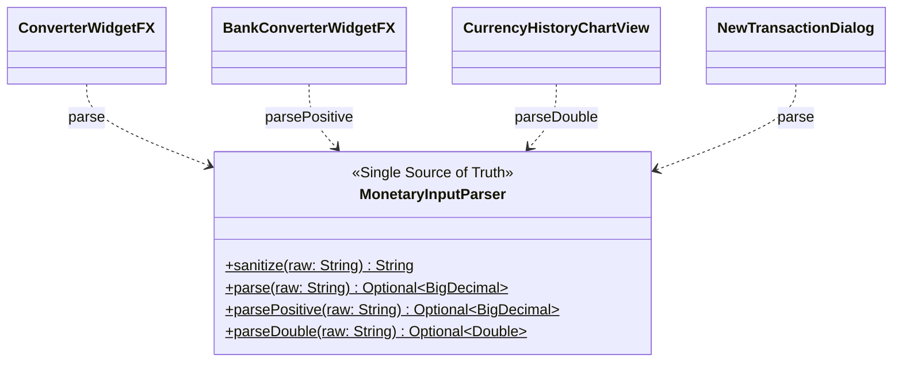

```mermaid
classDiagram
direction TB

class MonetaryInputParser {
    <<Single Source of Truth>>
    +sanitize(raw: String)$ String
    +parse(raw: String)$ Optional~BigDecimal~
    +parsePositive(raw: String)$ Optional~BigDecimal~
    +parseDouble(raw: String)$ Optional~Double~
}

class ConverterWidgetFX
class BankConverterWidgetFX
class CurrencyHistoryChartView
class NewTransactionDialog

ConverterWidgetFX ..> MonetaryInputParser : parse
BankConverterWidgetFX ..> MonetaryInputParser : parsePositive
CurrencyHistoryChartView ..> MonetaryInputParser : parseDouble
NewTransactionDialog ..> MonetaryInputParser : parse
```

