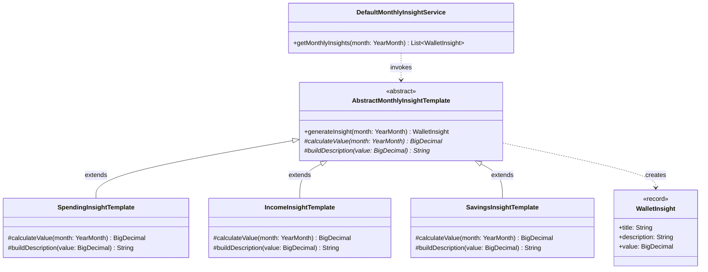

```mermaid
classDiagram
direction TB

class DefaultMonthlyInsightService {
    +getMonthlyInsights(month: YearMonth) List~WalletInsight~
}

class AbstractMonthlyInsightTemplate {
    <<abstract>>
    +generateInsight(month: YearMonth) WalletInsight
    #calculateValue(month: YearMonth)* BigDecimal
    #buildDescription(value: BigDecimal)* String
}

class SpendingInsightTemplate {
    #calculateValue(month: YearMonth) BigDecimal
    #buildDescription(value: BigDecimal) String
}

class IncomeInsightTemplate {
    #calculateValue(month: YearMonth) BigDecimal
    #buildDescription(value: BigDecimal) String
}

class SavingsInsightTemplate {
    #calculateValue(month: YearMonth) BigDecimal
    #buildDescription(value: BigDecimal) String
}

class WalletInsight {
    <<record>>
    +title: String
    +description: String
    +value: BigDecimal
}

DefaultMonthlyInsightService ..> AbstractMonthlyInsightTemplate : invokes
AbstractMonthlyInsightTemplate <|-- SpendingInsightTemplate : extends
AbstractMonthlyInsightTemplate <|-- IncomeInsightTemplate : extends
AbstractMonthlyInsightTemplate <|-- SavingsInsightTemplate : extends
AbstractMonthlyInsightTemplate ..> WalletInsight : creates
```

