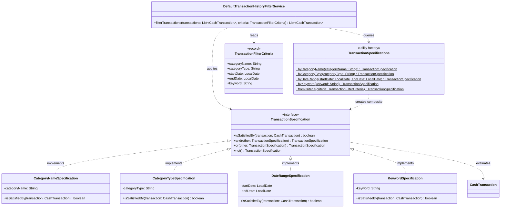

```mermaid
classDiagram
direction TB

class DefaultTransactionHistoryFilterService {
    +filterTransactions(transactions: List~CashTransaction~, criteria: TransactionFilterCriteria) List~CashTransaction~
}

class TransactionSpecifications {
    <<utility factory>>
    +byCategoryName(categoryName: String)$ TransactionSpecification
    +byCategoryType(categoryType: String)$ TransactionSpecification
    +byDateRange(startDate: LocalDate, endDate: LocalDate)$ TransactionSpecification
    +byKeyword(keyword: String)$ TransactionSpecification
    +fromCriteria(criteria: TransactionFilterCriteria)$ TransactionSpecification
}

class TransactionSpecification {
    <<interface>>
    +isSatisfiedBy(transaction: CashTransaction) boolean
    +and(other: TransactionSpecification) TransactionSpecification
    +or(other: TransactionSpecification) TransactionSpecification
    +not() TransactionSpecification
}

class CategoryNameSpecification {
    -categoryName: String
    +isSatisfiedBy(transaction: CashTransaction) boolean
}

class CategoryTypeSpecification {
    -categoryType: String
    +isSatisfiedBy(transaction: CashTransaction) boolean
}

class DateRangeSpecification {
    -startDate: LocalDate
    -endDate: LocalDate
    +isSatisfiedBy(transaction: CashTransaction) boolean
}

class KeywordSpecification {
    -keyword: String
    +isSatisfiedBy(transaction: CashTransaction) boolean
}

class TransactionFilterCriteria {
    <<record>>
    +categoryName: String
    +categoryType: String
    +startDate: LocalDate
    +endDate: LocalDate
    +keyword: String
}

class CashTransaction

DefaultTransactionHistoryFilterService ..> TransactionSpecifications : queries
DefaultTransactionHistoryFilterService ..> TransactionFilterCriteria : reads
DefaultTransactionHistoryFilterService ..> TransactionSpecification : applies
TransactionSpecifications ..> TransactionSpecification : creates composite
TransactionSpecification <|.. CategoryNameSpecification : implements
TransactionSpecification <|.. CategoryTypeSpecification : implements
TransactionSpecification <|.. DateRangeSpecification : implements
TransactionSpecification <|.. KeywordSpecification : implements
TransactionSpecification ..> CashTransaction : evaluates
```

