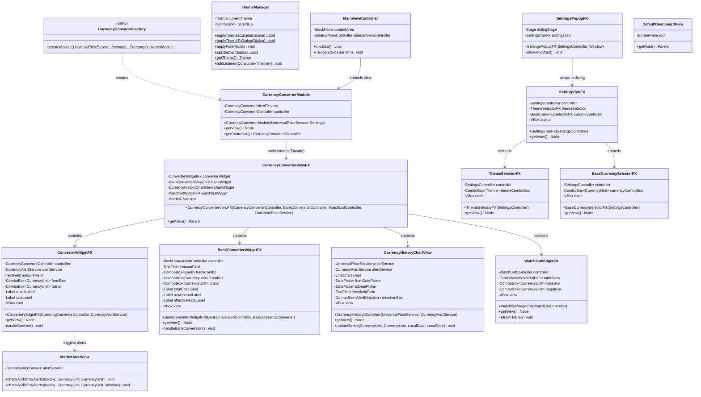

# OOP25-UniBodget — View - UML Class Diagram
GitHub renders the diagram below automatically.

```mermaid
classDiagram
    direction TB

    %% ============================================================
    %% ============ CONVERTER VIEW SUBSYSTEM ============
    %% ============================================================

    class CurrencyConverterModule {
        -CurrencyConverterViewFX view
        -CurrencyConverterController controller
        +CurrencyConverterModule(UniversalPriceService, Settings)
        +getView() Node
        +getController() CurrencyConverterController
    }

    class CurrencyConverterViewFX {
        -ConverterWidgetFX converterWidget
        -BankConverterWidgetFX bankWidget
        -CurrencyHistoryChartView chartWidget
        -WatchlistWidgetFX watchlistWidget
        -BorderPane root
        +CurrencyConverterViewFX(CurrencyConverterController, BankConversionController, WatchListController, UniversalPriceService)
        +getView() Parent
    }

    class CurrencyConverterFactory {
        <<utility>>
        +createModule(UniversalPriceService, Settings)$ CurrencyConverterModule
    }

    class ConverterWidgetFX {
        -CurrencyConverterController controller
        -CurrencyAlertService alertService
        -TextField amountField
        -ComboBox~CurrencyUnit~ fromBox
        -ComboBox~CurrencyUnit~ toBox
        -Label resultLabel
        -Label rateLabel
        -VBox card
        +ConverterWidgetFX(CurrencyConverterController, CurrencyAlertService)
        +getView() Node
        -handleConvert() void
    }

    class BankConverterWidgetFX {
        -BankConversionController controller
        -TextField amountField
        -ComboBox~Bank~ bankCombo
        -ComboBox~CurrencyUnit~ fromBox
        -ComboBox~CurrencyUnit~ toBox
        -Label totalCostLabel
        -Label netAmountLabel
        -Label effectiveRateLabel
        -VBox view
        +BankConverterWidgetFX(BankConversionController, BasicCurrencyConverter)
        +getView() Node
        -handleBankConversion() void
    }

    class CurrencyHistoryChartView {
        -UniversalPriceService priceService
        -CurrencyAlertService alertService
        -LineChart chart
        -DatePicker fromDatePicker
        -DatePicker toDatePicker
        -TextField thresholdField
        -ComboBox~AlertDirection~ directionBox
        -VBox view
        +CurrencyHistoryChartView(UniversalPriceService, CurrencyAlertService)
        +getView() Node
        +updateSeries(CurrencyUnit, CurrencyUnit, LocalDate, LocalDate) void
    }

    class WatchlistWidgetFX {
        -WatchListController controller
        -TableView~WatchlistPair~ tableView
        -ComboBox~CurrencyUnit~ baseBox
        -ComboBox~CurrencyUnit~ targetBox
        -VBox view
        +WatchlistWidgetFX(WatchListController)
        +getView() Node
        -refreshTable() void
    }

    class MarketAlertView {
        -CurrencyAlertService alertService
        +checkAndShowAlerts(double, CurrencyUnit, CurrencyUnit) void
        +checkAndShowAlerts(double, CurrencyUnit, CurrencyUnit, Window) void
    }

    CurrencyConverterModule --> CurrencyConverterViewFX : orchestrates (Facade)
    CurrencyConverterFactory ..> CurrencyConverterModule : creates
    CurrencyConverterViewFX --> ConverterWidgetFX : contains
    CurrencyConverterViewFX --> BankConverterWidgetFX : contains
    CurrencyConverterViewFX --> CurrencyHistoryChartView : contains
    CurrencyConverterViewFX --> WatchlistWidgetFX : contains

    ConverterWidgetFX ..> MarketAlertView : triggers alerts

    %% ============================================================
    %% ============ SETTINGS VIEW SUBSYSTEM  =============
    %% ============================================================

    class ThemeManager {
        -Theme currentTheme
        -Set~Scene~ SCENES
        +applyThemeToScene(Scene)$ void
        +applyThemeToDialog(Dialog)$ void
        +applyFont(Node)$ void
        +setTheme(Theme)$ void
        +getTheme()$ Theme
        +addListener(Consumer~Theme~)$ void
    }

    class SettingsTabFX {
        -SettingsController controller
        -ThemeSelectorFX themeSelector
        -BaseCurrencySelectorFX currencySelector
        -VBox layout
        +SettingsTabFX(SettingsController)
        +getView() Node
    }

    class SettingsPopupFX {
        -Stage dialogStage
        -SettingsTabFX settingsTab
        +SettingsPopupFX(SettingsController, Window)
        +showAndWait() void
    }

    class ThemeSelectorFX {
        -SettingsController controller
        -ComboBox~Theme~ themeComboBox
        -VBox node
        +ThemeSelectorFX(SettingsController)
        +getView() Node
    }

    class BaseCurrencySelectorFX {
        -SettingsController controller
        -ComboBox~CurrencyUnit~ currencyComboBox
        -VBox node
        +BaseCurrencySelectorFX(SettingsController)
        +getView() Node
    }

    SettingsTabFX --> ThemeSelectorFX : embeds
    SettingsTabFX --> BaseCurrencySelectorFX : embeds
    SettingsPopupFX --> SettingsTabFX : wraps in dialog

    %% ============================================================
    %% ============ SHELL & DASHBOARD VIEWS =======================
    %% ============================================================

    class MainViewController {
        -StackPane contentArea
        -SideBarViewController sideBarViewController
        +initialize() void
        +navigate(SideBarItem) void
    }

    class DefaultDashboardView {
        -BorderPane root
        +getRoot() Parent
    }

    MainViewController --> CurrencyConverterModule : embeds view
```
